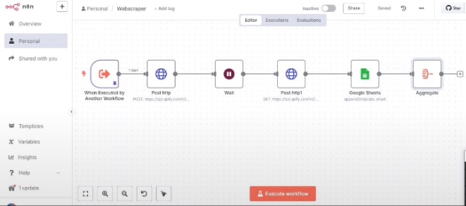

### AI Agent Webscraper

Intelligent Web Data Extraction Across Google Maps, Apollo, TikTok, Instagram & Facebook
Built using n8n, Apify, and Google Sheets

## Overview
This project is a modular and scalable AI-powered webscraper designed to extract structured and actionable data from platforms like Google Maps, Apollo, TikTok, Instagram, and Facebook. It leverages automation workflows, intelligent scraping logic, and live storage pipelines to enable real-time lead generation, market analysis, and content tracking without writing traditional code.

## Problem Statement
Manually collecting information from multiple platforms:  
-  Time-consuming and inefficient  
-  Prone to errors and outdated data  
-  Technically inaccessible to non-developers  
-  Difficult to unify across sources for analysis or sales  
-  Hard to update or scale as websites evolve

## Solutions Provided
-  Extract data from platforms like Google Maps, Apollo, TikTok, Instagram, and Facebook without manual browsing.
- Combines Apify actors, n8n workflows, and Google Sheets to simplify, store, and scale scraping pipelines.
- Collect updated contacts, engagement metrics, social profiles, and map listings for outreach, marketing, and analysis.
- No-code/low-code setup lets users edit scraping logic and data paths visually without scripting.
- Stores scraped results in Google Sheets or routes them to any external system via webhook, email, or voice synthesis.

## Tools 
n8n: Orchestrates scraping flow and logic control.
Apify: Executes AI scraping on dynamic websites.
Google Sheets : Stores and processes results for easy access |
CustomTools: Perform filtering, formatting, and output routing |

## Data Flow Structure:  
Trigger → Define Target URL → Call Apify Actor →
→ Scrape Page(s) → Format Results → Store in Sheets → Optional Output (Chatbot, CRM, Voice)

## Who This Helps
  
- Sales Teams: Automated lead generation from Apollo and Maps |
- Marketers: Monitor social engagement and influencer content |
- Researchers: Analyze business listings, social activity, regional trends | No-Code Builders | Plug-and-play scraping logic with zero scripting |
- Local Businesses: Track competition or nearby prospects via Maps |

## Use Case Example
- Goal: Extract restaurant listings from Google Maps
- Workflow triggers Apify actor with geo-target & keyword  
- Scrapes: business name, address, contact, ratings  
- Stores in Google Sheets

### Search Engine
   
    

## ✅ Solutions Breakdown
1. Workflow A – Data Trigger & POST to Apify
- Accepts user-defined input: target URLs, scraping parameters, business category, etc.
- Sends a POST HTTP request to Apify to start scraping using a selected actor.
- Records scrape job ID or dataset reference.

2. Workflow B – GET from Apify
- Scheduled or triggered by Workflow A after a delay.
- Uses GET HTTP to fetch results from Apify’s dataset API or key-value store.
- Cleans and formats the scraped data for output.

3. Workflow C – External Output or Trigger
- Final output is routed to Google Sheets, CRM, Telegram, or voice agent (e.g. ElevenLabs).
- Optionally triggers alerts or launches next scraping cycle.

## Architecture Overview
Main Workflow → POST HTTP →
→ [Wait / Trigger] → GET HTTP →
→ Format Results → Output to Sheets or System → Notify / Speak
